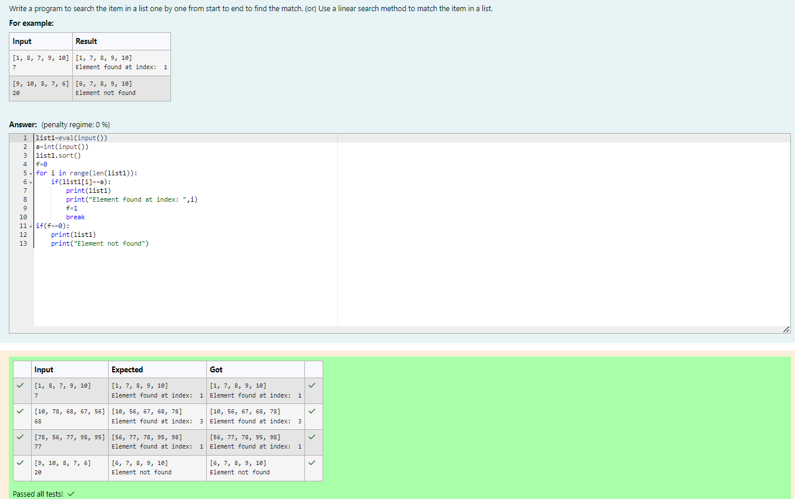
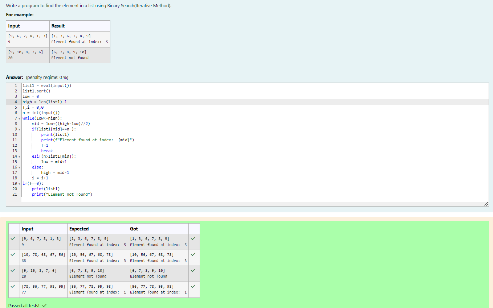
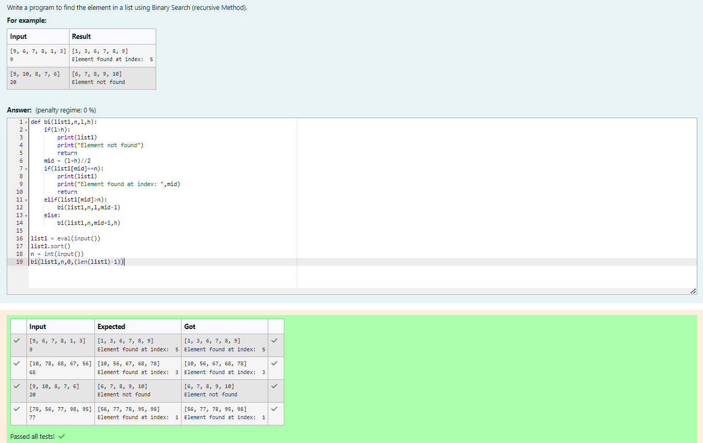

# Linear Search and Binary search
## Aim:
To write a program to perform linear search and binary search using python programming.
## Equipment’s required:
1.	Hardware – PCs
2.	Anaconda – Python 3.7 Installation / Moodle-Code Runner
## Algorithm:
## Linear Search:
1.	Start from the leftmost element of array[] and compare k with each element of array[] one by one.
2.	If k matches with an element in array[] , return the index.
3.	If k doesn’t match with any of elements in array[], return -1 or element not found.
## Binary Search:
1.	Set two pointers low and high at the lowest and the highest positions respectively.
2.	Find the middle element mid of the array ie. arr[(low + high)/2]
3.	If x == mid, then return mid.Else, compare the element to be searched with m.
4.	If x > mid, compare x with the middle element of the elements on the right side of mid. This is done by setting low to low = mid + 1.
5.	Else, compare x with the middle element of the elements on the left side of mid. This is done by setting high to high = mid - 1.
6.	Repeat steps 2 to 5 until low meets high
## Program:
i)	#Use a linear search method to match the item in a list.
```
list1=eval(input())
a=int(input())
list1.sort()
f=0
for i in range(len(list1)):
    if(list1[i]==a):
        print(list1)
        print("Element found at index: ",i)
        f=1
        break
if(f==0):
    print(list1)
    print("Element not found")
```
ii)	# Find the element in a list using Binary Search(Iterative Method).
```
list1 = eval(input())
list1.sort()
low = 0
high = len(list1)-1
f,i = 0,0
n = int(input())
while(low<=high):
    mid = low+((high-low)//2)
    if(list1[mid]==n ):
        print(list1)
        print(f"Element found at index:  {mid}")
        f=1
        break
    elif(n>list1[mid]):
        low = mid+1
    else:
        high = mid-1
    i = i+1
if(f==0):
    print(list1)
    print("Element not found")
```
iii)	# Find the element in a list using Binary Search (recursive Method).
```
def bi(list1,n,l,h):
    if(l>h):
        print(list1)
        print("Element not found")
        return 
    mid = (l+h)//2
    if(list1[mid]==n):
        print(list1)
        print("Element found at index: ",mid)
        return
    elif(list1[mid]>n):
        bi(list1,n,l,mid-1)
    else:
        bi(list1,n,mid+1,h)
    
list1 = eval(input())
list1.sort()
n = int(input())
bi(list1,n,0,(len(list1)-1))
```
## Sample Input and Output






## Result
Thus the linear search and binary search algorithm is implemented using python programming.
